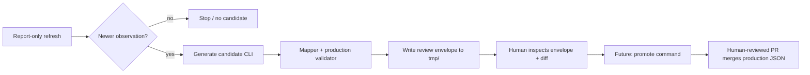

# GhostFlow Human-Reviewed Candidate Generation — Design Memo

**Status:** Architecture / contract design (read-only)  
**Date:** 2026-08-26  
**Scope:** Operator-ready, non-score-fed artifacts only  
**Merged baseline:** `main` @ `ae6fbf14a25e5e898d0874358bed17b26ba28c50` (includes PRs **#140–#144**)

> **This design does not authorize production writes, automatic promotion, or candidate commits to source control.**

---

## 1. Executive recommendation

Add a **new explicit layer** between the existing report-only operator runner and any future promotion command:

```
fetch → parse → normalize → [candidate generator] → review envelope on disk
                                    ↓
              (separate, later, human-approved) promotion → production `.v1.json`
```

**Recommendation:** **GO** — architecture approved; **implementation waits on a mapping-policy decision gate** (§21–§22).

**Sequence after PR #145 merges:**

1. **PR #145** — This architecture design (docs only).
2. **Mapping-policy decision gate** — Bobby approves production-mapping semantics; record in `DECISIONS.md`.
3. **PR A** — Pure types, authorized schema/validator updates, artifact mappers + tests (no I/O).
4. **PR B** — Generator, canonical hashing, diff, idempotent filesystem writer, CLI.
5. **PR C** — Promotion — **blocked** separately until DECISIONS authorization.

PR A **must not guess** production semantics (`seriesDefinition`, `source` block, `dataQuality`, `publishedAt`). See §7–§8, §22.

**Promotion (PR C)** remains blocked until Bobby approves a separate DECISIONS entry.

**Envelope shape:** Option **B** — a typed **review envelope** wrapping (a) human-review metadata and (b) a **validated proposed production artifact payload** that is byte-for-byte what promotion would write. Review-only fields never enter production JSON.

**Storage:** Option **B** — deterministic files under `tmp/ghostflow/candidates/` (already covered by repo `tmp/` gitignore). Generation is local runtime output only; promotion later copies an explicitly chosen envelope into a human-reviewed git PR.

**Atomicity:** The three operator artifacts promote **independently** (`acceptanceUnit: 'artifact'`). Running them together in one CLI session is orchestration only, not a transaction.

---

## 2. Existing refresh boundary (unchanged)

The report-only operator runner (`runGhostFlowOperatorReport`) **must remain unchanged**:

| Stage | Behavior |
|-------|----------|
| Fetch / parse / normalize | Via registered adapters |
| Compare | `candidate.observationAsOf` vs current production `asOf` |
| Emit | `GhostFlowRefreshReport` (`mode: 'report_only'`) |
| Write | **Nothing** — no production, candidate files, history, or scores |

Candidate generation is a **separate command** that reuses adapter stages (or accepts a pre-normalized observation in tests) but does not alter report semantics, planner grouping, score calculations, or `GHOSTFLOW_REFERENCE_AS_OF`.

**Operator allowlist (only these three):**

| Artifact | Lane | `candidateGroupId` | Active adapter |
|----------|------|--------------------|----------------|
| `systematicFlowProxy` | `display_only_equity` | `cftc_tff_systematic_display` | `cftc-tff-systematic-socrata` |
| `treasuryFuturesPositioningProxy` | `treasury_display` | `cftc_tff_treasury_display` | `cftc-tff-treasury-socrata` |
| `treasuryLongEndIncomeLens` | `treasury_display` | `frb_h15_treasury_long_end` | `frb-h15-treasury-yields-sdmx` |

**Explicitly out of scope:** `volatilityRegime`, `marketBreadth`, Gate C, score-fed promotion, VIX wiring.

---

## 3. Candidate lifecycle



1. Operator runs `ghostflow:refresh-report` (unchanged).
2. When status is `candidate_observation_available`, operator runs `ghostflow:generate-candidate --artifact <id>` explicitly.
3. Generator fetches/parses/normalizes (or accepts injected normalized observation in tests), maps to production shape, validates, writes envelope + diff.
4. Human inspects diff and provenance; selects a **specific envelope path** for promotion (never “latest”).
5. Future promotion command re-validates and writes production artifact locally → human PR → merge.

---

## 4. Candidate envelope

Separate **machine promotion payload** from **human review metadata**.

### 4.1 Top-level envelope (`GhostFlowCandidateEnvelope`)

| Field | Purpose |
|-------|---------|
| `candidateVersion` | Envelope schema version (start `'1'`) |
| `artifactId` | Registry artifact id |
| `artifactSchemaVersion` | Production artifact version (currently `'1'`) |
| `status` | `GhostFlowCandidateStatus` (see §12, §13) |
| `generatedAt` | ISO timestamp of generation run (**not** part of identity hash) |
| `generationMode` | `'operator_fetch'` initially |
| `humanReviewRequired` | Always `true` |
| `currentProduction` | Date-only summary + content fingerprint of current prod |
| `candidateIdentity` | Stable idempotency key (§5) |
| `normalizedObservation` | Full `GhostFlowNormalizedObservation` input (§6) |
| `proposedArtifact` | Exact production JSON candidate (§9) |
| `validation` | Production validator outcome |
| `diff` | Deterministic current vs proposed (§10) |
| `issues` | Fail-closed issue list |

### 4.2 What production promotion receives

Promotion consumes **only** `proposedArtifact` (after re-validation), not the envelope wrapper. Envelope fields like `diff`, `generatedAt`, and `issues` are review-only.

### 4.3 Reuse vs invent

- Reuse `GhostFlowNormalizedObservation`, `GhostFlowDurableProvenance`, `GhostFlowRefreshIssue`.
- Reuse `GhostFlowCurrentArtifactSummary` shape for `currentProduction` dates.
- Do **not** extend `GhostFlowRefreshReport` — reports stay metadata-only.
- GhostYield’s `candidates.manual.json` pattern is **not** reused (different product: scored tabular rows, no refresh pipeline).

---

## 5. Candidate identity / idempotency

### 5.1 Identity key (`GhostFlowCandidateIdentity`)

Candidate identity is based on **deterministic candidate/source/payload semantics**, not run metadata.

Deterministic hash input (canonical JSON, sorted keys, fixed field order in mapper output):

```
artifactId
+ observationAsOf (candidate)
+ provenance.contentSha256
+ provenance.adapterId
+ provenance.parserVersion
+ promotionPayloadSha256  // SHA-256 of canonical proposedArtifact JSON
```

**Not identity-defining** (may vary across repeated runs with the same logical candidate):

- `generatedAt` (envelope run timestamp)
- `retrievedAt` (fetch time in embedded `normalizedObservation.provenance`)
- Any other envelope run metadata

The embedded `normalizedObservation` may therefore contain a different `retrievedAt` on each fetch while `candidateIdentity.identitySha256` remains unchanged. **Do not hash the entire envelope.**

### 5.2 Filename

```
<artifactId>.<observationAsOf>.<identityPrefix>.candidate.json
```

- `identityPrefix` = first 12 hex chars of `identitySha256` (locator hint only).
- **Do not** embed `generatedAt` in filename.
- **Filename prefix is only a locator** — on collision or idempotent re-run, the generator **always reads the existing file** and verifies the **full** `candidateIdentity.identitySha256` and `promotionPayloadSha256` reconciliation before acting.

### 5.3 Idempotent re-run and collision behavior

When the target filename already exists, read and verify the stored envelope:

| Case | Behavior |
|------|----------|
| **A. Same full identity** — stored envelope has the same `candidateIdentity.identitySha256`, the same `promotionPayloadSha256`, and an internally valid identity↔payload relationship | Exit **0**, status `candidate_already_exists`. **Do not rewrite** the file. Preserve the stored envelope’s original `generatedAt`. Newly fetched `retrievedAt` (or other run metadata) alone is **not** a collision. |
| **B. Filename occupied, full identity differs** | Exit **6**, status `candidate_identity_collision` — fail closed. |
| **C. Stored envelope claims an identity but `proposedArtifact` hash does not reconcile with `promotionPayloadSha256`** | Exit **6**, status `candidate_identity_collision` / invalid stored candidate — fail closed. |

**Whole-envelope byte identity is not required** and must not be assumed. Only identity tuple + promotion payload hash must reconcile.

Different identity, same observation date: allowed (e.g. mapped-payload revision — §13).

---

## 6. Provenance contract

**Rule:** Candidate generation must consume the full `GhostFlowNormalizedObservation<TFields>` from adapter normalization — **not** reconstruct provenance from `GhostFlowCandidateObservationSummary`.

The summary exists only for report output. The envelope embeds:

```typescript
provenance: GhostFlowDurableProvenance // copied verbatim from normalized observation
```

Required durable fields (already enforced in `types.ts`):

- `sourceId`, `sourceLocator`, `retrievedAt`, `contentSha256`, `adapterId`, `parserVersion`
- `sourcePublishedAt`, `observationAsOf` when available

**Never persist:** raw CFTC JSON, raw Board ZIP/XML, `.env` values, local paths, secrets.

---

## 7. Artifact mappers

Each artifact gets a **pure** mapper registered by `artifactId`:

```typescript
GhostFlowCandidateMapper<TFields, TArtifact>
  map(input: GhostFlowCandidateMapperInput<TFields>): GhostFlowStageResult<TArtifact>
```

**PR A gate:** Mappers may be implemented only for semantics explicitly authorized by the mapping-policy decision gate (§21–§22). Until then, mapper contracts are specified here but **must not be coded with guessed values**.

### 7.1 `systematicFlowProxy`

| | |
|-|-|
| **Input** | `CftcTffSystematicNormalizedFields` + provenance |
| **Output** | `SystematicFlowProxyArtifactV1` (production mode) |
| **Invariants** | Compute `basket` from score contracts using existing artifact helpers; `datasetId` = `gpe5-46if`; `asOf` = observation date; no score wiring |
| **Blocked until decided** | `dataQuality` enum value (§22); `publishedAt` mapping (§8) |
| **Validator** | `validateSystematicFlowProxyArtifact` |

### 7.2 `treasuryFuturesPositioningProxy`

| | |
|-|-|
| **Input** | `CftcTffTreasuryNormalizedFields` + provenance |
| **Output** | `TreasuryFuturesPositioningArtifactV1` |
| **Invariants** | `mappingStatus: 'not_final'`; no forbidden score keys; basket observations from core contracts; preserve caveats template |
| **Blocked until decided** | `dataQuality` enum value (§22); `publishedAt` mapping (§8) |
| **Validator** | `validateTreasuryFuturesPositioningProxyArtifact(raw, { mode: 'production' })` |

### 7.3 `treasuryLongEndIncomeLens` — **PR A blockers**

Current committed production / validator still encode:

- `seriesDefinition`: `fred_treasury_long_end_income_lens_v1`
- `source` block: FRED-oriented metadata
- `observations.tenYearBreakevenInflationPct` (T10YIE / breakeven)

Approved **active source contract** (PR **#144**, DECISIONS) is now:

- Board H.15 (`frb_h15_treasury_yields`)
- Required: 30Y nominal + 30Y real
- Optional: 2Y / 5Y / 10Y
- **No T10YIE**, **no breakeven**

**Before PR A, Bobby must approve:**

| # | Decision |
|---|----------|
| A | Final Board-native `seriesDefinition` — **proposed (awaiting approval):** `frb_h15_treasury_long_end_income_lens_v1` (transport-neutral; do not embed `sdmx` in the semantic id unless evidence requires it) |
| B | Production Board H.15 `source` block contract + any required validator / display-copy truth changes |
| C | Whether validator/types must change to drop breakeven from automated candidate path (required by product contract) |

Do **not** recommend retaining the FRED-named `seriesDefinition` merely for validator continuity.

| | |
|-|-|
| **Input** | `FrbH15TreasuryNormalizedFields` + provenance |
| **Output** | `TreasuryLongEndIncomeLensArtifactV1` per approved mapping policy |
| **Invariants (product-locked)** | No T10YIE / breakeven; compute curve spreads via `computeCurveSpread`; `mappingStatus: 'not_final'`; optional context yields only when present in normalized fields |
| **Blocked until decided** | `seriesDefinition`, `source` block, `dataQuality`, `publishedAt` |
| **Validator** | `validateTreasuryLongEndIncomeLensArtifact(raw, { mode: 'production' })` — may require schema updates authorized by mapping decision |

Mappers live in `lib/ghostflow/refresh/candidateMappers/` (proposed) behind `GHOSTFLOW_CANDIDATE_MAPPER_REGISTRY` — no giant switch in the generator.

---

## 8. Production field mapping policies (open decisions — block PR A)

### 8.1 `publishedAt`

Production artifacts require `publishedAt`. CFTC adapters provide durable provenance including `retrievedAt` and `contentSha256` but **do not fabricate** `sourcePublishedAt`. Board H.15 normalized provenance may likewise lack a source publication date suitable for the production artifact field.

**Do not authorize PR A to invent:**

- report date + N days heuristics
- `retrievedAt` as `publishedAt`
- generic “Friday release” rules
- holiday-adjusted release logic

without an explicit approved contract.

**Mapper rule:** If the approved mapping policy does not define `publishedAt` for an artifact/lane, the mapper **must fail closed** (`mapper_failed` / block issue) rather than emit a semantically uncertain date.

**Open decision:** “Production `publishedAt` mapping policy for automated CFTC and Board H.15 candidates.” Document options and evidence in DECISIONS; do not resolve here unless Bobby has explicitly approved one.

### 8.2 `dataQuality`

Current production validators and artifacts use manual-era vocabulary (`verified_manual`, `manual_unverified`). Automated source-validated candidates must **not** silently inherit `verified_manual`.

**Before PR A, Bobby must choose:**

| Option | Meaning |
|--------|---------|
| **A.** Introduce `verified_automated` | New enum value + validator updates (preferred architecture recommendation, **not** approved) |
| **B.** Retain existing enum | With explicitly documented semantics for machine-generated, validator-passed candidates |

PR A **must not** label machine-generated candidates `verified_manual` without an approved policy.

---

## 9. Existing validator reuse

Pipeline (fail-closed):

```
GhostFlowNormalizedObservation
  → artifact-specific mapper
  → validate*Artifact(proposed, { mode: 'production' })
  → envelope.validation + envelope.proposedArtifact
```

- **Do not** duplicate validation rules.
- **Do not** bypass validators for “almost valid” payloads.
- If **current production** fails validation when loaded for diff, status `current_production_invalid` — no candidate (or envelope with block status only — prefer **no write**).

Treasury artifacts: preserve `mappingStatus: 'not_final'` and forbidden score key scans.

---

## 10. Diff contract

`GhostFlowCandidateDiff` — factual data review only; no investment language.

| Section | Content |
|---------|---------|
| `currentObservationAsOf` | Production `asOf` |
| `candidateObservationAsOf` | Proposed `asOf` |
| `observationDateRelation` | `'newer' \| 'same' \| 'older'` |
| `fieldAdditions` | Keys present in candidate, absent in current |
| `fieldRemovals` | Keys present in current, absent in candidate |
| `fieldChanges` | `{ path, currentValue, candidateValue }[]` — leaf-level, JSON-path notation |
| `candidateSourceProvenance` | Snapshot of **candidate-side** durable provenance from `normalizedObservation` (informational; not compared to production — production has no accepted source hash baseline) |
| `promotionPayloadChanged` | boolean — SHA-256 of canonical mapped production JSON vs current production fingerprint |

Implementation: deep structural diff on **mapped production artifacts** (post-mapper), not on normalized fields alone — humans review what would ship.

**Excluded from diff narrative:** score interpretation, allocation advice, “recommend replace” language.

---

## 11. Storage / naming

**Recommended path:** `tmp/ghostflow/candidates/` (default, overridable via `--out-dir` constrained to repo `tmp/` subtree).

| Option | Verdict |
|--------|---------|
| A. Ephemeral only | Too fragile for human review workflow |
| B. Gitignored review directory | **Recommended** |
| C. Commit candidates to git | **Not now** — promotion PR commits production `.v1.json` only |

Add explicit `.gitignore` comment optional; `tmp/` already gitignored.

**Security:** `--out-dir` must resolve under `tmp/ghostflow/` (or `tmp/`) within repo root; reject `..` traversal.

---

## 12. Newer-observation behavior

Align with operator runner date comparison (`candidateDate > currentDate`):

| Condition | Candidate generation |
|-----------|---------------------|
| `candidateAsOf > currentAsOf` | Generate if mapper + validator pass → status `ready_for_review` |
| `candidateAsOf === currentAsOf` | See §13 (revision) |
| `candidateAsOf < currentAsOf` | **No candidate** → status `no_newer_observation`, exit **2** |
| Normalize future vs `nowIso` | Fail at normalize (adapter already enforces) → exit **4** |
| Fetch/parse/normalize failure | No candidate → exit **4** |
| Mapper/validator failure | No candidate → exit **5** |

**Same date, same payload hash:** status `no_change`, exit **2** (no write).

---

## 13. Same-date revision behavior

When `candidateAsOf === currentAsOf`, **do not silently ignore**. The generator compares **mapped production payloads** (current committed artifact vs newly proposed artifact). It does **not** compare candidate source bytes against an accepted provenance baseline stored in production — because **current production artifacts do not persist** accepted normalized provenance such as `contentSha256`, `adapterId`, or `parserVersion`.

### 13.1 Currently detectable (without production provenance extension)

| Condition | Detection | Status | Candidate file? |
|-----------|-----------|--------|-----------------|
| Same `asOf`, proposed production payload differs | `promotionPayloadSha256` ≠ current production fingerprint | `revision_review_required` | Yes — envelope written (exit **3**) |
| Same `asOf`, proposed production payload identical | Hashes match | `no_change` | No (exit **2**) |

Mapped-payload revisions (including those caused by parser migration or upstream source-byte changes that **did** change mapped output) surface as `revision_review_required`. **None auto-promote.**

### 13.2 Currently NOT detectable

| Condition | Why |
|-----------|-----|
| Same `asOf` + upstream source bytes changed + **mapped production payload remained identical** | No accepted source-content hash stored in current production to compare against |

Do **not** infer byte-only revisions from `source.note` prose or other non-durable production fields.

### 13.3 Future accepted-provenance baseline (not authorized here)

Byte-only revision classification becomes possible only after a future accepted-provenance record exists, such as:

- promotion receipt metadata
- accepted normalized history store
- production artifact provenance extension

**None is authorized by this design.** Do not add one in PR A/B.

**Product decision (does not block PR A/B):** Whether same-date mapped-payload revisions should ever promote without a DECISIONS entry — default **human required** (§22.2).

Operator runner today returns `no_newer_observation` for same/older dates — **generator is stricter** for same-date **mapped-payload** changes the report collapses.

---

## 14. CLI design (not implemented)

**New command** (do not overload `ghostflow:refresh-report`):

```bash
npm run ghostflow:generate-candidate -- --artifact <id> [--out-dir tmp/ghostflow/candidates] [--as-of YYYY-MM-DD]
```

| Flag | Behavior |
|------|----------|
| `--artifact` | **Required** initially (one id per invocation) |
| `--out-dir` | Optional; constrained under `tmp/ghostflow/` |
| `--as-of` | Optional normalize ceiling (same as refresh report) |

**`--artifact all`:** Defer until single-artifact path is proven; optional later convenience running allowlist sequentially with independent exit codes.

### Exit codes

| Code | Meaning |
|------|---------|
| 0 | Candidate envelope written (or idempotent already exists) |
| 1 | Unexpected internal error |
| 2 | No candidate warranted (`no_newer_observation`, `no_change`) |
| 3 | Revision review envelope written (`revision_review_required`) |
| 4 | Source pipeline failure (fetch/parse/normalize) |
| 5 | Validation failure (current prod, mapper, or production validator) |
| 6 | Candidate identity collision |

Stdout: JSON summary mirroring envelope `status`, `candidateIdentity`, output path — **no raw market values in logs** (optional `--verbose` for local debug only).

---

## 15. Failure / exit model (fail-closed)

| Failure | Candidate written? | Exit |
|---------|-------------------|------|
| Fetch failure | No | 4 |
| Parse failure | No | 4 |
| Normalize failure | No | 4 |
| Current production invalid | No | 5 |
| Mapper failure | No | 5 |
| Production validator failure | No | 5 |
| Serialization failure | No | 1 |
| Identity collision | No | 6 |
| Partial artifact data in normalize | No | 4/5 (adapter-specific) |
| Source revision (same date) | Yes (review envelope) | 3 |

**Rule:** No candidate file on failed validation.

---

## 16. Promotion boundary (design only)

Future command (separate approval):

```bash
npm run ghostflow:promote-candidate -- --envelope <path> [--dry-run]
```

Gates:

1. Envelope file exists and parses.
2. `envelope.status` ∈ `{ ready_for_review, revision_review_required }`.
3. Re-run production validator on `proposedArtifact`.
4. Explicit `--envelope` path (hash verified against envelope identity).
5. Human confirmation / DECISIONS authorization.
6. Write **only** registry `artifactPath` production JSON.
7. Optional history action — separate step (§17).

**Never:** auto-select latest candidate, auto-promote on generate, write during generate.

---

## 17. History boundary

Registry `historyPolicy: 'accepted_normalized_observation'` applies to **accepted** observations, not raw downloads.

| Approach | Recommendation |
|----------|----------------|
| A. History write in promotion | **Preferred** — one human action accepts observation + updates history |
| B. Separate history command | Acceptable later |

**Do not implement now.** Existing research scripts write to gitignored `data/ghostflow/research/` — not the same as accepted production history.

Treasury/systematic proxies **do not** embed `historySummary` today (unlike tail-skew). Any embedded history summary requires separate authorization.

---

## 18. Human-review workflow (recommended)

1. `npm run ghostflow:refresh-report` — scan statuses (unchanged).
2. `npm run ghostflow:generate-candidate -- --artifact <id>` — materialize envelope(s).
3. Inspect envelope JSON + `diff` section locally.
4. Human selects specific envelope file by path/hash.
5. (Future) `promote-candidate` writes production JSON locally.
6. `npm run ghostflow:check` + tests + lint + build.
7. Human-reviewed PR updating **only** `data/ghostflow/artifacts/<id>.v1.json`.
8. Merge.

**Not approved:** automatic PR creation from generator.

---

## 19. Security / source hygiene

- Persist only normalized fields + durable provenance + mapped production JSON.
- Never write raw API/ZIP/XML responses to candidate directory.
- No `.env` reads beyond existing adapter patterns.
- Output directory constrained to `tmp/ghostflow/**`.
- Candidate envelopes are local review artifacts — treat as sensitive operational data, not public commits.

---

## 20. Proposed TypeScript contracts

*(Design-only — not yet in `lib/`)*

**Identity vs envelope:** `GhostFlowCandidateIdentity` does **not** include `generatedAt` or `retrievedAt`. The envelope embeds run metadata and the full `normalizedObservation` (which includes `retrievedAt`). Repeated runs with the same identity may produce **different envelope bytes** — that is expected. **Do not hash the entire envelope.** Idempotency reconciles identity + promotion payload only (§5.3).
```typescript
export const GHOSTFLOW_CANDIDATE_ENVELOPE_VERSION = '1' as const;

export type GhostFlowCandidateStatus =
  | 'ready_for_review'           // newer observation, valid
  | 'revision_review_required'   // same asOf, material change
  | 'no_change'                  // same asOf, identical payload
  | 'no_newer_observation'       // older asOf
  | 'source_failed'
  | 'current_production_invalid'
  | 'mapper_failed'
  | 'validation_failed'
  | 'candidate_already_exists'
  | 'candidate_identity_collision';

export type GhostFlowCandidateGenerationMode = 'operator_fetch';

export interface GhostFlowCandidateIdentity {
  artifactId: GhostFlowOperatorReportArtifactId;
  observationAsOf: string;
  contentSha256: string;
  adapterId: string;
  parserVersion: string;
  promotionPayloadSha256: string;
  /** SHA-256 of canonical identity tuple; hex. Excludes generatedAt, retrievedAt, and all run metadata. */
  identitySha256: string;
}

export interface GhostFlowCandidateProductionFingerprint {
  observationAsOf: string;
  sourcePublishedAt?: string;
  promotionPayloadSha256: string;
}

export interface GhostFlowCandidateFieldChange {
  path: string;
  currentValue: unknown;
  candidateValue: unknown;
}

export interface GhostFlowCandidateDiff {
  currentObservationAsOf: string;
  candidateObservationAsOf: string;
  observationDateRelation: 'newer' | 'same' | 'older';
  fieldAdditions: readonly string[];
  fieldRemovals: readonly string[];
  fieldChanges: readonly GhostFlowCandidateFieldChange[];
  /** Candidate-side provenance snapshot; not a production baseline comparison */
  candidateSourceProvenance: GhostFlowDurableProvenance;
  promotionPayloadChanged: boolean;
}

export interface GhostFlowCandidateValidationResult {
  ok: boolean;
  validatorId: string; // e.g. 'validateTreasuryLongEndIncomeLensArtifact'
  errors: readonly string[];
  warnings?: readonly string[];
}

export interface GhostFlowCandidateEnvelope<TArtifact = unknown> {
  candidateVersion: typeof GHOSTFLOW_CANDIDATE_ENVELOPE_VERSION;
  artifactId: GhostFlowOperatorReportArtifactId;
  artifactSchemaVersion: '1';
  status: GhostFlowCandidateStatus;
  generatedAt: string;
  generationMode: GhostFlowCandidateGenerationMode;
  humanReviewRequired: true;
  currentProduction: GhostFlowCurrentArtifactSummary & {
    promotionPayloadSha256?: string;
  };
  candidateIdentity: GhostFlowCandidateIdentity;
  normalizedObservation: GhostFlowNormalizedObservation<unknown>;
  proposedArtifact: TArtifact;
  validation: GhostFlowCandidateValidationResult;
  diff: GhostFlowCandidateDiff;
  issues: readonly GhostFlowRefreshIssue[];
}

export interface GhostFlowCandidateMapperInput<TFields> {
  normalized: GhostFlowNormalizedObservation<TFields>;
  registryEntry: GhostFlowRefreshRegistryEntry;
}

export interface GhostFlowCandidateMapper<TFields, TArtifact> {
  artifactId: GhostFlowOperatorReportArtifactId;
  map(input: GhostFlowCandidateMapperInput<TFields>): GhostFlowStageResult<TArtifact>;
}
```

---

## 21. Implementation PR sequence

| Step | Scope | Deliverables |
|------|-------|--------------|
| **#145** | Architecture design | This memo (docs only) |
| **Decision gate** | Mapping policy | Bobby approves production-mapping semantics; `DECISIONS.md` update |
| **PR A** | Types + mappers | Candidate types; **schema/validator updates explicitly authorized by mapping decision**; pure artifact mappers; mapper fixture tests; **no I/O** |
| **PR B** | Generator + CLI | `generateGhostFlowCandidate()`; canonical hashing; diff; idempotent filesystem writer (§5.3); `ghostflow:generate-candidate`; integration tests |
| **PR C** | Promotion | **Blocked** — separate DECISIONS authorization |

**PR A must not start until the decision gate closes.** Mappers must not guess `seriesDefinition`, `source` block, `dataQuality`, or `publishedAt`.

**Alternative:** If mapping-policy validator/schema changes are large, land them as a dedicated PR **between the decision gate and PR A** rather than hiding schema work inside mapper commits.

PR A/B do not change operator runner behavior.

---

## 22. Open decisions (require Bobby approval)

### 22.1 Block PR A (mapping-policy gate)

1. **Long-End Board-native `seriesDefinition`** — proposed (awaiting approval): `frb_h15_treasury_long_end_income_lens_v1`. Do not retain FRED-named id for validator continuity alone.
2. **Long-End Board H.15 production `source` block** — contract + any required validator / display-copy truth changes (current production is FRED-oriented; active contract is Board H.15, no T10YIE).
3. **`dataQuality` vocabulary** for automated validated candidates — `verified_automated` (preferred recommendation, not approved) vs retain existing enum with documented semantics (§8.2).
4. **Production `publishedAt` mapping policy** for automated CFTC and Board H.15 candidates (§8.1). Mappers fail closed until defined.

### 22.2 Do not block PR A/B; block later promotion / policy

5. **Same-date restatement promotion policy** — when `asOf` unchanged but mapped payload differs, is promotion allowed without version bump? (Generator may still emit `revision_review_required` envelopes for review.)
6. **Promotion command authorization** — separate DECISIONS entry before PR C.
7. **History / accepted-provenance write timing** — promotion receipt, accepted normalized history, or production provenance extension (enables byte-only revision detection later).

---

## 23. Falsifiers

This design is **wrong** if:

- Production validators cannot express automated Board/CFTC payloads without rule changes.
- Mappers require hidden score computation or LLM transformation.
- Candidate identity collisions occur routinely at 12-hex prefix (would require longer prefix).
- Report-only runner must mutate to pass normalized payloads (should not — generator re-fetches or accepts inject in tests).
- Gate C requires cross-artifact atomic promotion (it does not — `acceptanceUnit: 'artifact'` for these three).

---

## Appendix: Relationship to PR #144

PR **#144** merged SDMX transport for `treasuryLongEndIncomeLens`. Candidate generation **inherits** that adapter for normalize input but does **not** change registry, operator runner, or production artifacts. CSV adapter `frb-h15-treasury-yields-csv` **1.0.1** remains for manual parity only.
