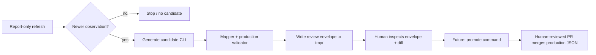

# GhostFlow Human-Reviewed Candidate Generation — Design Memo

**Status:** Architecture / contract design (read-only)  
**Date:** 2026-08-26  
**Scope:** Operator-ready, non-score-fed artifacts only  
**Merged baseline:** `main` @ `ae6fbf14a25e5e898d0874358bed17b26ba28c50` (includes PRs **#140–#144**)

> **This design does not authorize production writes, automatic promotion, or candidate commits to source control.**

---

## 1. Executive recommendation

Add a **new explicit layer** between the existing report-only operator runner and any future promotion command:

```
fetch → parse → normalize → [candidate generator] → review envelope on disk
                                    ↓
              (separate, later, human-approved) promotion → production `.v1.json`
```

**Recommendation:** **GO** — implement in two coding PRs after this memo merges:

1. **PR A** — Pure candidate types, artifact-specific mappers, mapper tests (no I/O, no CLI).
2. **PR B** — Candidate generator, deterministic diff, gitignored filesystem writer, `ghostflow:generate-candidate` CLI.

**Promotion (PR C)** remains blocked until Bobby approves a separate DECISIONS entry.

**Envelope shape:** Option **B** — a typed **review envelope** wrapping (a) human-review metadata and (b) a **validated proposed production artifact payload** that is byte-for-byte what promotion would write. Review-only fields never enter production JSON.

**Storage:** Option **B** — deterministic files under `tmp/ghostflow/candidates/` (already covered by repo `tmp/` gitignore). Generation is local runtime output only; promotion later copies an explicitly chosen envelope into a human-reviewed git PR.

**Atomicity:** The three operator artifacts promote **independently** (`acceptanceUnit: 'artifact'`). Running them together in one CLI session is orchestration only, not a transaction.

---

## 2. Existing refresh boundary (unchanged)

The report-only operator runner (`runGhostFlowOperatorReport`) **must remain unchanged**:

| Stage | Behavior |
|-------|----------|
| Fetch / parse / normalize | Via registered adapters |
| Compare | `candidate.observationAsOf` vs current production `asOf` |
| Emit | `GhostFlowRefreshReport` (`mode: 'report_only'`) |
| Write | **Nothing** — no production, candidate files, history, or scores |

Candidate generation is a **separate command** that reuses adapter stages (or accepts a pre-normalized observation in tests) but does not alter report semantics, planner grouping, score calculations, or `GHOSTFLOW_REFERENCE_AS_OF`.

**Operator allowlist (only these three):**

| Artifact | Lane | `candidateGroupId` | Active adapter |
|----------|------|--------------------|----------------|
| `systematicFlowProxy` | `display_only_equity` | `cftc_tff_systematic_display` | `cftc-tff-systematic-socrata` |
| `treasuryFuturesPositioningProxy` | `treasury_display` | `cftc_tff_treasury_display` | `cftc-tff-treasury-socrata` |
| `treasuryLongEndIncomeLens` | `treasury_display` | `frb_h15_treasury_long_end` | `frb-h15-treasury-yields-sdmx` |

**Explicitly out of scope:** `volatilityRegime`, `marketBreadth`, Gate C, score-fed promotion, VIX wiring.

---

## 3. Candidate lifecycle



1. Operator runs `ghostflow:refresh-report` (unchanged).
2. When status is `candidate_observation_available`, operator runs `ghostflow:generate-candidate --artifact <id>` explicitly.
3. Generator fetches/parses/normalizes (or accepts injected normalized observation in tests), maps to production shape, validates, writes envelope + diff.
4. Human inspects diff and provenance; selects a **specific envelope path** for promotion (never “latest”).
5. Future promotion command re-validates and writes production artifact locally → human PR → merge.

---

## 4. Candidate envelope

Separate **machine promotion payload** from **human review metadata**.

### 4.1 Top-level envelope (`GhostFlowCandidateEnvelope`)

| Field | Purpose |
|-------|---------|
| `candidateVersion` | Envelope schema version (start `'1'`) |
| `artifactId` | Registry artifact id |
| `artifactSchemaVersion` | Production artifact version (currently `'1'`) |
| `status` | `GhostFlowCandidateStatus` (see §11, §12) |
| `generatedAt` | ISO timestamp of generation run (**not** part of identity hash) |
| `generationMode` | `'operator_fetch'` initially |
| `humanReviewRequired` | Always `true` |
| `currentProduction` | Date-only summary + content fingerprint of current prod |
| `candidateIdentity` | Stable idempotency key (§6) |
| `normalizedObservation` | Full `GhostFlowNormalizedObservation` input (§7) |
| `proposedArtifact` | Exact production JSON candidate (§8) |
| `validation` | Production validator outcome |
| `diff` | Deterministic current vs proposed (§9) |
| `issues` | Fail-closed issue list |

### 4.2 What production promotion receives

Promotion consumes **only** `proposedArtifact` (after re-validation), not the envelope wrapper. Envelope fields like `diff`, `generatedAt`, and `issues` are review-only.

### 4.3 Reuse vs invent

- Reuse `GhostFlowNormalizedObservation`, `GhostFlowDurableProvenance`, `GhostFlowRefreshIssue`.
- Reuse `GhostFlowCurrentArtifactSummary` shape for `currentProduction` dates.
- Do **not** extend `GhostFlowRefreshReport` — reports stay metadata-only.
- GhostYield’s `candidates.manual.json` pattern is **not** reused (different product: scored tabular rows, no refresh pipeline).

---

## 5. Candidate identity / idempotency

### 5.1 Identity key (`GhostFlowCandidateIdentity`)

Deterministic hash input (canonical JSON, sorted keys, fixed field order in mapper output):

```
artifactId
+ observationAsOf (candidate)
+ provenance.contentSha256
+ provenance.adapterId
+ provenance.parserVersion
+ promotionPayloadSha256  // SHA-256 of canonical proposedArtifact JSON
```

**`generatedAt` is excluded** from identity so repeated runs with identical source data produce the same identity.

### 5.2 Filename (§10)

```
<artifactId>.<observationAsOf>.<identityPrefix>.candidate.json
```

- `identityPrefix` = first 12 hex chars of `promotionPayloadSha256` (or full identity hash prefix).
- **Do not** embed `generatedAt` in filename — avoids duplicate files for identical data.

### 5.3 Collision behavior

| Case | Behavior |
|------|----------|
| Same identity, byte-identical envelope | Exit **0**, status `candidate_already_exists` (idempotent no-op) |
| Same identity, different bytes | Exit **6** `candidate_identity_collision` — fail closed; human must investigate |
| Different identity, same observation date | Allowed (e.g. source revision — §12) |

---

## 6. Provenance contract

**Rule:** Candidate generation must consume the full `GhostFlowNormalizedObservation<TFields>` from adapter normalization — **not** reconstruct provenance from `GhostFlowCandidateObservationSummary`.

The summary exists only for report output. The envelope embeds:

```typescript
provenance: GhostFlowDurableProvenance // copied verbatim from normalized observation
```

Required durable fields (already enforced in `types.ts`):

- `sourceId`, `sourceLocator`, `retrievedAt`, `contentSha256`, `adapterId`, `parserVersion`
- `sourcePublishedAt`, `observationAsOf` when available

**Never persist:** raw CFTC JSON, raw Board ZIP/XML, `.env` values, local paths, secrets.

---

## 7. Artifact mappers

Each artifact gets a **pure** mapper registered by `artifactId`:

```typescript
GhostFlowCandidateMapper<TFields, TArtifact>
  map(input: GhostFlowCandidateMapperInput<TFields>): GhostFlowStageResult<TArtifact>
```

### 7.1 `systematicFlowProxy`

| | |
|-|-|
| **Input** | `CftcTffSystematicNormalizedFields` + provenance dates |
| **Output** | `SystematicFlowProxyArtifactV1` (production mode) |
| **Invariants** | Compute `basket` from score contracts using existing artifact helpers; `datasetId` = `gpe5-46if`; `dataQuality: 'verified_manual'` for automated path; `asOf` = observation date; `publishedAt` from provenance or CFTC release rule; no score wiring |
| **Validator** | `validateSystematicFlowProxyArtifact` |

### 7.2 `treasuryFuturesPositioningProxy`

| | |
|-|-|
| **Input** | `CftcTffTreasuryNormalizedFields` + provenance |
| **Output** | `TreasuryFuturesPositioningArtifactV1` |
| **Invariants** | `mappingStatus: 'not_final'`; no forbidden score keys; basket observations from core contracts; preserve caveats template |
| **Validator** | `validateTreasuryFuturesPositioningProxyArtifact(raw, { mode: 'production' })` |

### 7.3 `treasuryLongEndIncomeLens`

| | |
|-|-|
| **Input** | `FrbH15TreasuryNormalizedFields` + provenance |
| **Output** | `TreasuryLongEndIncomeLensArtifactV1` |
| **Invariants** | **No `T10YIE` / breakeven**; compute curve spreads via `computeCurveSpread`; `mappingStatus: 'not_final'`; Board H.15 source block (not FRED); optional context yields only when present in normalized fields |
| **Validator** | `validateTreasuryLongEndIncomeLensArtifact(raw, { mode: 'production' })` |

**Open product note:** Current committed production artifact still references FRED source metadata and includes `tenYearBreakevenInflationPct`. New Board SDMX candidates **must omit breakeven** per DECISIONS. Whether `seriesDefinition` string changes from `fred_treasury_long_end_income_lens_v1` requires Bobby approval (§21).

Mappers live in `lib/ghostflow/refresh/candidateMappers/` (proposed) behind `GHOSTFLOW_CANDIDATE_MAPPER_REGISTRY` — no giant switch in the generator.

---

## 8. Existing validator reuse

Pipeline (fail-closed):

```
GhostFlowNormalizedObservation
  → artifact-specific mapper
  → validate*Artifact(proposed, { mode: 'production' })
  → envelope.validation + envelope.proposedArtifact
```

- **Do not** duplicate validation rules.
- **Do not** bypass validators for “almost valid” payloads.
- If **current production** fails validation when loaded for diff, status `current_production_invalid` — no candidate (or envelope with block status only — prefer **no write**).

Treasury artifacts: preserve `mappingStatus: 'not_final'` and forbidden score key scans.

---

## 9. Diff contract

`GhostFlowCandidateDiff` — factual data review only; no investment language.

| Section | Content |
|---------|---------|
| `currentObservationAsOf` | Production `asOf` |
| `candidateObservationAsOf` | Proposed `asOf` |
| `observationDateRelation` | `'newer' \| 'same' \| 'older'` |
| `fieldAdditions` | Keys present in candidate, absent in current |
| `fieldRemovals` | Keys present in current, absent in candidate |
| `fieldChanges` | `{ path, currentValue, candidateValue }[]` — leaf-level, JSON-path notation |
| `provenanceChanges` | Subset diff on durable provenance fields |
| `promotionPayloadChanged` | boolean (hash comparison) |

Implementation: deep structural diff on **mapped production artifacts** (post-mapper), not on normalized fields alone — humans review what would ship.

**Excluded from diff narrative:** score interpretation, allocation advice, “recommend replace” language.

---

## 10. Storage / naming

**Recommended path:** `tmp/ghostflow/candidates/` (default, overridable via `--out-dir` constrained to repo `tmp/` subtree).

| Option | Verdict |
|--------|---------|
| A. Ephemeral only | Too fragile for human review workflow |
| B. Gitignored review directory | **Recommended** |
| C. Commit candidates to git | **Not now** — promotion PR commits production `.v1.json` only |

Add explicit `.gitignore` comment optional; `tmp/` already gitignored.

**Security:** `--out-dir` must resolve under `tmp/ghostflow/` (or `tmp/`) within repo root; reject `..` traversal.

---

## 11. Newer-observation behavior

Align with operator runner date comparison (`candidateDate > currentDate`):

| Condition | Candidate generation |
|-----------|---------------------|
| `candidateAsOf > currentAsOf` | Generate if mapper + validator pass → status `ready_for_review` |
| `candidateAsOf === currentAsOf` | See §12 (revision) |
| `candidateAsOf < currentAsOf` | **No candidate** → status `no_newer_observation`, exit **2** |
| Normalize future vs `nowIso` | Fail at normalize (adapter already enforces) → exit **4** |
| Fetch/parse/normalize failure | No candidate → exit **4** |
| Mapper/validator failure | No candidate → exit **5** |

**Same date, same payload hash:** status `no_change`, exit **2** (no write).

---

## 12. Same-date revision behavior

When `candidateAsOf === currentAsOf`, **do not silently ignore**. Classify:

| Revision kind | Detection | Status | Candidate file? |
|---------------|-----------|--------|-----------------|
| Source byte revision | `contentSha256` changed, values same | `revision_review_required` | Yes — envelope written |
| Parser migration | `parserVersion` changed | `revision_review_required` | Yes |
| Normalized value revision | Field values differ | `revision_review_required` | Yes |
| Identical | Hash + values match | `no_change` | No |

**None auto-promote.** Operator runner today returns `no_newer_observation` for same/older dates — **generator is stricter** and surfaces revisions the report currently collapses.

**Product decision flagged:** Whether same-date value revisions should ever promote without a DECISIONS entry (e.g. Board restatements) — default **human required**.

---

## 13. CLI design (not implemented)

**New command** (do not overload `ghostflow:refresh-report`):

```bash
npm run ghostflow:generate-candidate -- --artifact <id> [--out-dir tmp/ghostflow/candidates] [--as-of YYYY-MM-DD]
```

| Flag | Behavior |
|------|----------|
| `--artifact` | **Required** initially (one id per invocation) |
| `--out-dir` | Optional; constrained under `tmp/ghostflow/` |
| `--as-of` | Optional normalize ceiling (same as refresh report) |

**`--artifact all`:** Defer until single-artifact path is proven; optional later convenience running allowlist sequentially with independent exit codes.

### Exit codes

| Code | Meaning |
|------|---------|
| 0 | Candidate envelope written (or idempotent already exists) |
| 1 | Unexpected internal error |
| 2 | No candidate warranted (`no_newer_observation`, `no_change`) |
| 3 | Revision review envelope written (`revision_review_required`) |
| 4 | Source pipeline failure (fetch/parse/normalize) |
| 5 | Validation failure (current prod, mapper, or production validator) |
| 6 | Candidate identity collision |

Stdout: JSON summary mirroring envelope `status`, `candidateIdentity`, output path — **no raw market values in logs** (optional `--verbose` for local debug only).

---

## 14. Failure / exit model (fail-closed)

| Failure | Candidate written? | Exit |
|---------|-------------------|------|
| Fetch failure | No | 4 |
| Parse failure | No | 4 |
| Normalize failure | No | 4 |
| Current production invalid | No | 5 |
| Mapper failure | No | 5 |
| Production validator failure | No | 5 |
| Serialization failure | No | 1 |
| Identity collision | No | 6 |
| Partial artifact data in normalize | No | 4/5 (adapter-specific) |
| Source revision (same date) | Yes (review envelope) | 3 |

**Rule:** No candidate file on failed validation.

---

## 15. Promotion boundary (design only)

Future command (separate approval):

```bash
npm run ghostflow:promote-candidate -- --envelope <path> [--dry-run]
```

Gates:

1. Envelope file exists and parses.
2. `envelope.status` ∈ `{ ready_for_review, revision_review_required }`.
3. Re-run production validator on `proposedArtifact`.
4. Explicit `--envelope` path (hash verified against envelope identity).
5. Human confirmation / DECISIONS authorization.
6. Write **only** registry `artifactPath` production JSON.
7. Optional history action — separate step (§17).

**Never:** auto-select latest candidate, auto-promote on generate, write during generate.

---

## 16. History boundary

Registry `historyPolicy: 'accepted_normalized_observation'` applies to **accepted** observations, not raw downloads.

| Approach | Recommendation |
|----------|----------------|
| A. History write in promotion | **Preferred** — one human action accepts observation + updates history |
| B. Separate history command | Acceptable later |

**Do not implement now.** Existing research scripts write to gitignored `data/ghostflow/research/` — not the same as accepted production history.

Treasury/systematic proxies **do not** embed `historySummary` today (unlike tail-skew). Any embedded history summary requires separate authorization.

---

## 17. Human-review workflow (recommended)

1. `npm run ghostflow:refresh-report` — scan statuses (unchanged).
2. `npm run ghostflow:generate-candidate -- --artifact <id>` — materialize envelope(s).
3. Inspect envelope JSON + `diff` section locally.
4. Human selects specific envelope file by path/hash.
5. (Future) `promote-candidate` writes production JSON locally.
6. `npm run ghostflow:check` + tests + lint + build.
7. Human-reviewed PR updating **only** `data/ghostflow/artifacts/<id>.v1.json`.
8. Merge.

**Not approved:** automatic PR creation from generator.

---

## 18. Security / source hygiene

- Persist only normalized fields + durable provenance + mapped production JSON.
- Never write raw API/ZIP/XML responses to candidate directory.
- No `.env` reads beyond existing adapter patterns.
- Output directory constrained to `tmp/ghostflow/**`.
- Candidate envelopes are local review artifacts — treat as sensitive operational data, not public commits.

---

## 19. Proposed TypeScript contracts

*(Design-only — not yet in `lib/`)*

```typescript
export const GHOSTFLOW_CANDIDATE_ENVELOPE_VERSION = '1' as const;

export type GhostFlowCandidateStatus =
  | 'ready_for_review'           // newer observation, valid
  | 'revision_review_required'   // same asOf, material change
  | 'no_change'                  // same asOf, identical payload
  | 'no_newer_observation'       // older asOf
  | 'source_failed'
  | 'current_production_invalid'
  | 'mapper_failed'
  | 'validation_failed'
  | 'candidate_already_exists'
  | 'candidate_identity_collision';

export type GhostFlowCandidateGenerationMode = 'operator_fetch';

export interface GhostFlowCandidateIdentity {
  artifactId: GhostFlowOperatorReportArtifactId;
  observationAsOf: string;
  contentSha256: string;
  adapterId: string;
  parserVersion: string;
  promotionPayloadSha256: string;
  /** SHA-256 of canonical identity tuple; hex */
  identitySha256: string;
}

export interface GhostFlowCandidateProductionFingerprint {
  observationAsOf: string;
  sourcePublishedAt?: string;
  promotionPayloadSha256: string;
}

export interface GhostFlowCandidateFieldChange {
  path: string;
  currentValue: unknown;
  candidateValue: unknown;
}

export interface GhostFlowCandidateDiff {
  currentObservationAsOf: string;
  candidateObservationAsOf: string;
  observationDateRelation: 'newer' | 'same' | 'older';
  fieldAdditions: readonly string[];
  fieldRemovals: readonly string[];
  fieldChanges: readonly GhostFlowCandidateFieldChange[];
  provenanceChanges: readonly GhostFlowCandidateFieldChange[];
  promotionPayloadChanged: boolean;
}

export interface GhostFlowCandidateValidationResult {
  ok: boolean;
  validatorId: string; // e.g. 'validateTreasuryLongEndIncomeLensArtifact'
  errors: readonly string[];
  warnings?: readonly string[];
}

export interface GhostFlowCandidateEnvelope<TArtifact = unknown> {
  candidateVersion: typeof GHOSTFLOW_CANDIDATE_ENVELOPE_VERSION;
  artifactId: GhostFlowOperatorReportArtifactId;
  artifactSchemaVersion: '1';
  status: GhostFlowCandidateStatus;
  generatedAt: string;
  generationMode: GhostFlowCandidateGenerationMode;
  humanReviewRequired: true;
  currentProduction: GhostFlowCurrentArtifactSummary & {
    promotionPayloadSha256?: string;
  };
  candidateIdentity: GhostFlowCandidateIdentity;
  normalizedObservation: GhostFlowNormalizedObservation<unknown>;
  proposedArtifact: TArtifact;
  validation: GhostFlowCandidateValidationResult;
  diff: GhostFlowCandidateDiff;
  issues: readonly GhostFlowRefreshIssue[];
}

export interface GhostFlowCandidateMapperInput<TFields> {
  normalized: GhostFlowNormalizedObservation<TFields>;
  registryEntry: GhostFlowRefreshRegistryEntry;
}

export interface GhostFlowCandidateMapper<TFields, TArtifact> {
  artifactId: GhostFlowOperatorReportArtifactId;
  map(input: GhostFlowCandidateMapperInput<TFields>): GhostFlowStageResult<TArtifact>;
}
```

---

## 20. Implementation PR sequence

| PR | Scope | Deliverables |
|----|-------|--------------|
| **A** | Mappers + types in `lib/` | Interfaces above; three pure mappers; fixture tests from normalized observations; validator pass tests |
| **B** | Generator + CLI | `generateGhostFlowCandidate()`; diff engine; filesystem writer; `ghostflow:generate-candidate` script; integration tests with mocked fetch |
| **C** | Promotion | **Blocked** — requires DECISIONS + explicit approval |

PR A can land without changing operator runner behavior.

---

## 21. Open decisions (require Bobby approval)

1. **`treasuryLongEndIncomeLens` `seriesDefinition` string** — keep `fred_treasury_long_end_income_lens_v1` for validator continuity vs migrate to Board-native id.
2. **Production `source` block migration** — FRED-shaped production artifact vs Board H.15 source metadata in promoted JSON (transport is Board; display copy may need coordinated UI/doc update).
3. **Same-date Board restatement policy** — when `asOf` unchanged but yields revised, is promotion allowed without version bump?
4. **`dataQuality` enum** for automated candidates — introduce `verified_automated` vs retain `verified_manual` with provenance note.
5. **Promotion command authorization** — separate DECISIONS entry before PR C.
6. **History writes** — whether promotion appends to gitignored research history or embedded summaries.

---

## 22. Falsifiers

This design is **wrong** if:

- Production validators cannot express automated Board/CFTC payloads without rule changes.
- Mappers require hidden score computation or LLM transformation.
- Candidate identity collisions occur routinely at 12-hex prefix (would require longer prefix).
- Report-only runner must mutate to pass normalized payloads (should not — generator re-fetches or accepts inject in tests).
- Gate C requires cross-artifact atomic promotion (it does not — `acceptanceUnit: 'artifact'` for these three).

---

## Appendix: Relationship to PR #144

PR **#144** merged SDMX transport for `treasuryLongEndIncomeLens`. Candidate generation **inherits** that adapter for normalize input but does **not** change registry, operator runner, or production artifacts. CSV adapter `frb-h15-treasury-yields-csv` **1.0.1** remains for manual parity only.
